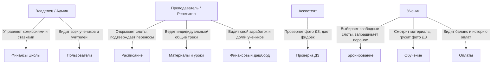

# Product Specification: Помощник репетитора и онлайн/оффлайн школа

> Документ описывает бизнес-логику, сценарии использования и правила предметной области.

---

## 1. Позиционирование продукта

* **Модель**: Single-School (авторская школа / репетиторский центр).
* **Формат**: Гибрид (Онлайн + Оффлайн).
* **Философия**: Удобный, не перегруженный ассистент для преподавателя, ученика и владельца школы. Минимум бюрократии, максимум удобства в планировании занятий, сдаче заданий и прозрачности денег.

---

## 2. Ролевая модель и их боли/задачи

### 2.1. Ученик (Student)
* **Задачи**:
  * Видеть доступные слоты своего преподавателя и бронировать уроки.
  * Управлять переносом/отменой занятий по понятным правилам.
  * Видеть свои уроки (онлайн-ссылка или оффлайн-адрес).
  * Сдавать домашку (прикреплять пачку фото тетради).
  * Видеть свой баланс / статус оплаты за занятия.

### 2.2. Преподаватель / Репетитор (Teacher)
* **Задачи**:
  * Настраивать сетку свободных слотов (рабочие часы).
  * Подтверждать/отклонять бронирования и запросы на перенос.
  * Отмечать факт проведения занятия ("Проведено", "Пропуск по уважительной", "Неявка").
  * **Персональный финансовый дашборд**: сколько уроков провел, сколько заработал, сколько ученики должны за проведенные уроки.
  * Вести программу обучения (общий шаблон курса + адаптация под конкретного ученика).

### 2.3. Ассистент (Assistant)
* **Задачи**:
  * Очередь проверки домашних заданий.
  * Просмотр фото решений, выставление статуса (`Принято` / `На доработку`), текстовый фидбек.
  * Разгрузка преподавателя от рутины.

### 2.4. Владелец школы / Главный админ (Owner)
* **Задачи**:
  * Управление составом преподавателей и ассистентов.
  * Настройка финансовых условий: фиксированная ставка или процент/комиссия школы с урока.
  * **Сводный финансовый дашборд**: оборот школы, долги учеников, задолженность школы перед преподавателями / процент преподавателей школе.

---

## 3. Бизнес-логика MVP v1: Расписание, Кабинеты и Занятия

### 3.1. Управление ресурсами и прикрепление учеников (Admin/Owner)
1. **Кабинеты школы (`Classroom`)**:
   * Создаются и настраиваются администратором/владельцем (название, вместимость, цвет плашки, описание).
   * Являются разделяемым физическим ресурсом школы.
2. **Прикрепление учеников к преподавателям (`TeacherStudent`)**:
   * Администратор закрепляет ученика за конкретным преподавателем по предмету.
   * Преподаватель видит в своем списке только своих прикрепленных учеников и назначает уроки именно им.
   * Администратор имеет сквозной обзор всего расписания школы (по преподавателям, кабинетам и ученикам).

### 3.2. Назначение уроков преподавателем
* Преподаватель выбирает ученика из своего списка, задает дату и время урока.
* **Формат проведения**:
  * `online`: прикрепляется ссылка (Zoom, Google Meet, Telegram и т.д.), кабинет не резервируется.
  * `offline`: выбирается конкретный кабинет школы из доступных.
* **Правило нахлёста занятий (Overlapping)**:
  * Система **разрешает** преподавателю ставить уроки внахлёст (например, Ученик А 15:00–16:00, Ученик Б 15:45–16:45 в том же кабинете или онлайн), так как преподаватель сознательно планирует входной опрос/тестирование второго ученика.
  * Защита от коллизий кабинета: два **разных** преподавателя не могут занять один и тот же кабинет в пересекающийся интервал.

### 3.3. Согласование учеником и жизненный цикл урока (Lesson State Machine)
* Урок, созданный преподавателем, получает статус `pending_confirmation` (ожидает подтверждения).
* Ученик видит назначенное занятие в личном кабинете:
  * Кнопка **«Принять»** $\to$ статус становится `confirmed` (занятие утверждено).
  * Кнопка **«Отклонить»** $\to$ статус становится `declined` (с возможностью указать причину для преподавателя).
* **Жизненный цикл после подтверждения**:
  * `confirmed` (урок подтвержден обоими)
  * `completed` (преподаватель провел занятие — в Фазе 3 триггерит финансовые начисления)
  * `cancelled_by_teacher` / `cancelled_by_student` (отменено)
  * `no_show` (ученик подтвердил, но не пришел — отметка репетитора)

---

## 4. Бизнес-логика финансов (Tutor Ledger)

Вместо сложного эквайринга на старте делаем **удобную систему учета баланса и платежей**:

1. **Биллинг за занятие**:
   * Каждое проведенное занятие (`completed`) имеет стоимость (например, 2000 ₽).
   * По правилам школы:
     * Доля преподавателя: например, 70% (1400 ₽) или фикс ставка (1200 ₽/час).
     * Доля школы (комиссия): например, 30% (600 ₽).
2. **Фиксация оплат**:
   * Родитель/ученик перевел деньги (по СБП/карте/наличными).
   * Преподаватель или админ отмечает: "Получено 10 000 ₽ за 5 занятий" (пополнение баланса ученика).
3. **Дашборд преподавателя**:
   * Сумма к выплате за месяц.
   * Количество проведенных уроков.
   * Список должников среди своих учеников.
4. **Дашборд владельца**:
   * Общая выручка школы.
   * Чистая прибыль (доля школы).
   * Балансы взаиморасчетов с каждым преподавателем.

---

## 5. Бизнес-логика курсов и ДЗ (Этап 2)

### 5.1. Курсы с возможностью адаптации
* Есть **Базовый курс (Шаблон программы)**: Модули -> Уроки -> Задания.
* Преподаватель может:
  * Привязать ученика к базовому курсу целиком.
  * Сформировать **индивидуальную траекторию**: скрыть ненужные темы, добавить индивидуальные задания, поменять порядок под класс ученика.

### 5.2. Домашки (Проверка фото)
* Ученик делает работу в тетради, фотографирует на телефон (1-10 фото).
* Загрузка через форму с превью и сортировкой страниц.
* Статусы:
  * `draft` -> `submitted` -> `in_review` -> `approved` / `needs_revision`.
* Ассистент/преподаватель оставляет комментарии к конкретным страницам/задачам.
